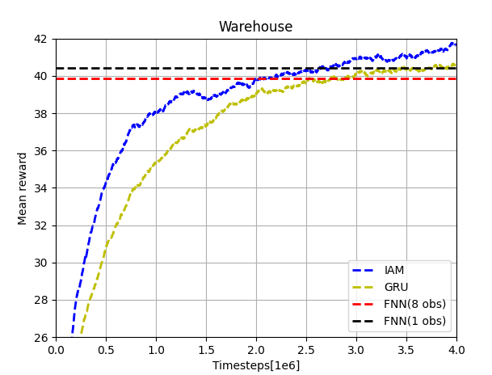
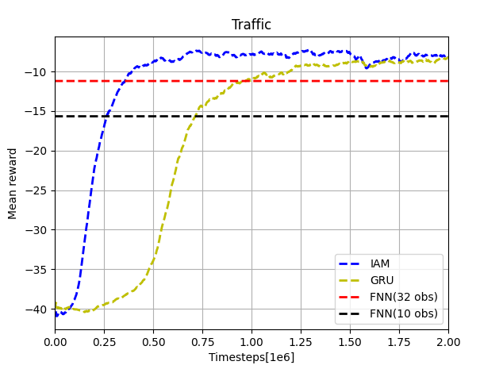
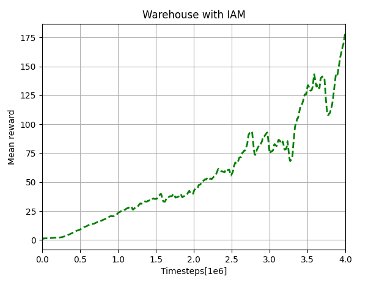

# IAM-Reproduce
This repo is for the Influence-Aware Memory(IAM) architecture(https://arxiv.org/abs/1911.07643), based on the pytorch structure of https://github.com/ikostrikov/pytorch-a2c-ppo-acktr-gail and the paper's repo source https://github.com/INFLUENCEorg/influence-aware-memory

## Run

To run for different scenarios, use the following codes

```bash
cd YOUR_PATH/IAM-Reproduce
```
### Warehouse and Traffic Control

Run FNN8 (32)
```bash
python main.py --env-name warehouse --num-steps 8 --recurrent-policy --log-dir ./log_w/
python main.py --env-name traffic --num-steps 32 --recurrent-policy --num-env-steps 2000000 --num-processes 1 --log-dir ./log_tc/
```
Run FNN1 (10)
```bash
python main.py --env-name warehouse --num-steps 1 --recurrent-policy --log-dir ./log_w/
python main.py --env-name traffic --num-steps 10 --recurrent-policy --num-env-steps 2000000 --num-processes 1 --log-dir ./log_tc/
```
Run GRU only
```bash
python main.py --env-name warehouse --num-steps 8 --log-dir ./log_w/
python main.py --env-name traffic --num-steps 32 --num-env-steps 2000000 --num-processes 1 --log-dir ./log_tc/
```
Run IAM
```bash
python main.py --env-name warehouse --num-steps 8 --IAM --log-dir ./log_w/
python main.py --env-name traffic --num-steps 32 --IAM --num-env-steps 2000000 --num-processes 1 --log-dir ./log_tc/
```
NOTE: 
1. To render the warehouse dynamics, alter the variable `render_bool` to True  in `warehouse.py`, and run with just 1 processes(recommended, because all processes will pop out)
2. The `log_xxx`folder will store the monitor files of all processes and a manually stored file `mean_rewards_xxx.txt` recording the mean rewards.

The results are saved in ./log (warehouse) and ./log_t (traffic), respectively. To visualize the results, run the following code. EWMA method is used to smooth the collected data.
```bash
python plot_results.py
```

Currently the results of mean rewards is like:




### Atari
To run flicker Atari 'BreakoutNoFrameskip-v4' without flickering, use:

```bash
python main.py --env-name BreakoutNoFrameskip-v4 --num-processes 4 --num-env-steps 4000000 --num-steps 5 --log-dir ./log_fa/
```

The result:



To run flicker Atari 'BreakoutNoFrameskip-v4' with flickering, use:

```bash
python main.py --env-name BreakoutNoFrameskip-v4 --num-processes 4 --num-env-steps 4000000 --num-steps 5 --log-dir ./log_fa/ --flicker
```

For the result with flickering, we are still testing.

## Work

The work is customized in:

1. Embed three environments(warehouse, traffic control with sumo and Atari from Gym) in the pytorch structure
2. Design `IAMModel.py` for Influence-Aware Model, used with A2C
3. Visualize the result, and compare them with the original paper