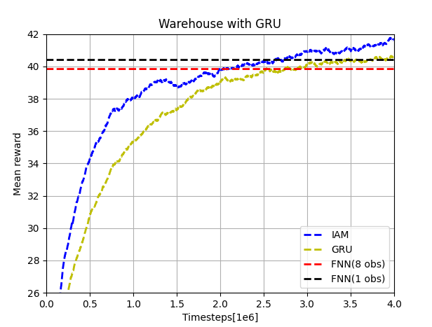
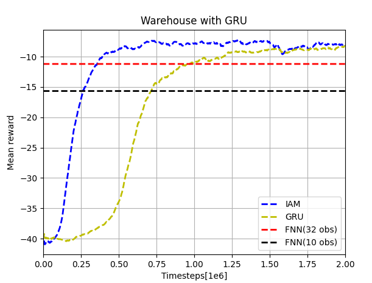

# IAM-Reproduce
This repo is for the Influence-Aware Memory(IAM) architecture(https://arxiv.org/abs/1911.07643), based on the pytorch structure of https://github.com/ikostrikov/pytorch-a2c-ppo-acktr-gail and the paper's repo source https://github.com/INFLUENCEorg/influence-aware-memory

## Run

To run for different situations, use the following codes
Run FNN8 (32)
```bash
python main.py --env-name 'warehouse' --num-steps 8 --recurrent-policy 
python main.py --env-name 'traffic' --num-steps 32 --recurrent-policy --num-env-steps 2000000 --num-processes 1
```
Run FNN1 (10)
```bash
python main.py --env-name 'warehouse' --num-steps 1 --recurrent-policy 
python main.py --env-name 'traffic' --num-steps 10 --recurrent-policy --num-env-steps 2000000 --num-processes 1
```
Run GRU only
```bash
python main.py --env-name 'warehouse' --num-steps 8
python main.py --env-name 'traffic' --num-steps 32 --num-env-steps 2000000 --num-processes 1
```
Run IAM
```bash
python main.py --env-name 'warehouse' --num-steps 8 --IAM
python main.py --env-name 'traffic' --num-steps 32 --IAM --num-env-steps 2000000 --num-processes 1
```
The results are saved in ./log (warehouse) and ./log_t (traffic), respectively. To visualize the results, run the following code. EWMA method is used to smooth the collected data.
```bash
python plot_results.py
```

Currently the result of mean rewards is like:




