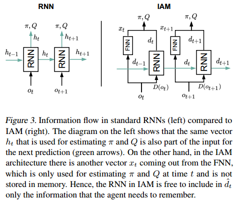
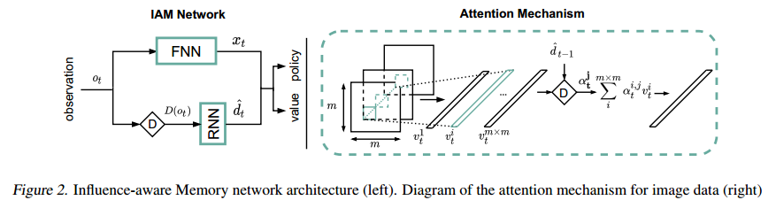

# Influence-aware Memory Architecture

Reproduce project of the IAM paper


# Authors

*   Jianfeng Cui
*   Zheyu Du

# Remark

This blog has been submitted to https://reproducedpapers.org, which features a collection of reproducibility attempts of papers in the field of Deep Learning by various people. If you are interested, feel free to check it out!

# Introduction



# Network Architecture
The Influence-Aware Memory network architecture is shown in the left of Figure 2.



We implemented this work in Python 3, under the PyTorch framework. In this blog some code snippets will be pasted here for illustration. First, we defined a base class inherited from `nn.Module`(only the constructor function is shown to illustrate the workflow):
```python
class IAMBase(nn.Module):
    """
    Influence-Aware Memory archtecture
    NOTE: Implement later as a base for different tasks
    """
    def __init__(self, recurrent, IAM, recurrent_input_size, hidden_size):
        super(IAMBase, self).__init__()

        self._hidden_size = hidden_size
        self._recurrent = recurrent
        self._IAM = IAM

        if recurrent:
            self.gru = nn.GRU(recurrent_input_size, hidden_size)
            for name, param in self.gru.named_parameters():
                if 'bias' in name:
                    nn.init.constant_(param, 0)
                elif 'weight' in name:
                    nn.init.orthogonal_(param)
```

In this base module, the GRU recurrent network in IAM is initialized. Note that the arguments `recurrent` and `IAM` are boolean variables of our use to switch architecture between IAM, plain GRU and FNN for subsequent experiments. Here for IAM they will be both manually set to True during the running time.

## Warehouse

```python
class warehouseBase(IAMBase):
    """
    IAM architecture for Warehouse environment

    obs ->  |fnn |            ->|-> |nn  | ->value
            |____|              |   |____|
                                |   
        ->  |dset|  -> |gru | ->|-> |nn  | ->dist()->mode()/sample()->action 
            |____|     |____|       |____|
    
    NOTE:
    observation: (num_processes, num_inputs: 73 in warehouse)
    fnn output: (num_processes, hidden_size_fnn)
    dset output: (num_processes, 25)
    gru output: ((num_processes, hidden_size_gru), rnn_hxs)
    output_size:  hidden_size_fnn plus hidden_size_gru
    """
    def __init__(self, num_inputs, hxs_size, recurrent=False, IAM=False, hidden_size=64):
        super(warehouseBase, self).__init__(recurrent, IAM, hxs_size, hidden_size)

        self.dset = [0, 49, 50, 51, 52, 53, 54, 55, 56, 57, 58, 59, 60, 61, 62,
           63, 64, 65, 66, 67, 68, 69, 70, 71, 72]

        init_ = lambda m: init(m, nn.init.orthogonal_, lambda x: nn.init.
                               constant_(x, 0), np.sqrt(2))

        self.actor = nn.Sequential(
            init_(nn.Linear(2*hidden_size, hidden_size)))

        self.critic = nn.Sequential(
            init_(nn.Linear(2*hidden_size, 1)))

        self.critic_n = nn.Sequential(
            init_(nn.Linear(hidden_size, 1)))

        self.fnn = nn.Sequential(
            init_(nn.Linear(num_inputs, 512)),nn.ReLU(),
            init_(nn.Linear(512, 256)),nn.ReLU(),
            init_(nn.Linear(256, hidden_size)),nn.ReLU())

        self.train()
```

In this scenario, the robot needs to fetch the items that appear with probability 0.05 on the shelves at the edges of the 7x7 grid representing a warehouse. The robot receives a reward of +1 every time it collects an item, which will get canceled if they are not collected before 8 timesteps since they appear. In the experiments we have a prior knowledge on what variables should be memorized. So the d-sets are manually selected, and the RNN in IAM only receives the latter variables while the FNN processes the entire vector. 

Here the FNN and two small nets for the action and value generation are defined. The observations are a combination of the agent’s location (one-hot encoded vector) and the 24 item binary variables. The d-set containing the indexes of the observation vector is defined, and to do the extraction, a simple indexing can be performed by:

```python
    def manual_dpatch(self, network_input):
        
        inf_hidden = network_input[:, self.dset]

        return inf_hidden
```

Now we have all ingredients for the flow of the architecture, so the forward function can be constructed:

```python
    def forward(self, inputs, rnn_hxs, masks):
        x = inputs

        if self.is_recurrent:
            if self.is_IAM:
                x_rec = self.manual_dpatch(x)
                x_rec, rnn_hxs = self._forward_gru(x_rec, rnn_hxs, masks)
                fnn_out = self.fnn(x)
                x = torch.cat((x_rec,fnn_out), 1)
            else:
                x, rnn_hxs = self._forward_gru(x, rnn_hxs, masks)
        else:
            x = self.fnn(x)
        
        if self.is_IAM:
            hidden_critic = self.critic(x)
            hidden_actor = self.actor(x)
        else:
            hidden_critic = self.critic_n(x)
            hidden_actor = x

        return hidden_critic, hidden_actor, rnn_hxs
```

Recall that now in IAM the `self._recurrent` and `self.is_IAM` are both True. As illustrated in the paper, the input separately flows into FNN, and d-set extraction following with RNN. They then are concatenated, and allocated to the actor and critic net.

## Traffic Control

In this environment, the agent must optimize the traffic flow at the intersection. The agent can take two different actions: either switching the traffic light on the top to green, which automatically turns the other to red, or vice versa. The observations are binary vectors that encode whether not there is a car at a particular location. Again, the d-set is manually selected, and the RNN in IAM receives the last two elements in each of the two vectors encoding the road segments (i.e. 4 bits in total). The network for this task can be defined below:

```python
class trafficBase(IAMBase):
    """
    IAM architecture for traffic control environment
    NOTE: dset output: (num_processes, 4)
    """
    def __init__(self, num_inputs, hxs_size, recurrent=False, IAM=False, hidden_size=8):
        super(trafficBase, self).__init__(recurrent, IAM, hxs_size, hidden_size)

        self.dset = [13, 14, 28, 29]

        init_ = lambda m: init(m, nn.init.orthogonal_, lambda x: nn.init.
                               constant_(x, 0), np.sqrt(2))

        self.actor = nn.Sequential(
            init_(nn.Linear(2*hidden_size, hidden_size)))

        self.critic = nn.Sequential(
            init_(nn.Linear(2*hidden_size, 1)))

        self.critic_n = nn.Sequential(
            init_(nn.Linear(hidden_size, 1)))

        self.fnn = nn.Sequential(
            init_(nn.Linear(num_inputs, 256)),nn.ReLU(),
            init_(nn.Linear(256, 64)),nn.ReLU(),
            init_(nn.Linear(64, hidden_size)),nn.ReLU())

        self.train()
```


## Flickering Atari


# Experiment (plots and analysis)


# Summary (accomplishment, drawbacks, improvement)
