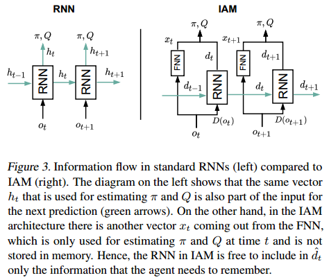
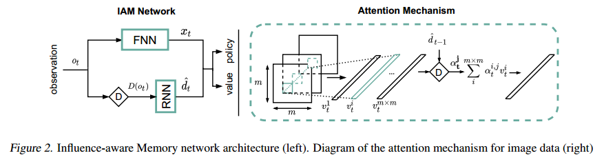
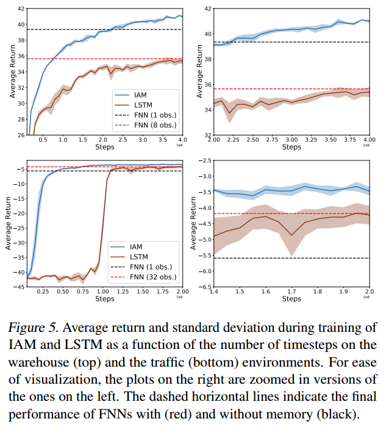
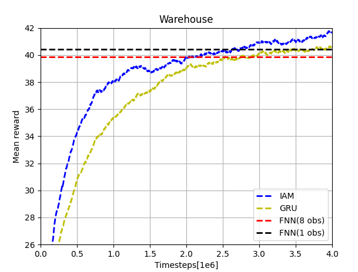
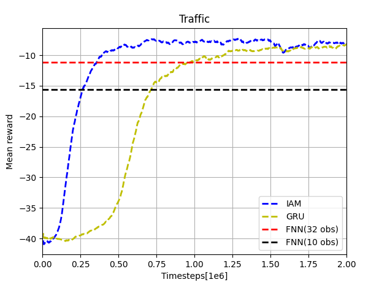

<head>
    <script src="https://cdnjs.cloudflare.com/ajax/libs/mathjax/2.7.1/MathJax.js?config=TeX-AMS-MML_HTMLorMML" type="text/javascript"></script>
    <script type="text/x-mathjax-config">
        MathJax.Hub.Config({
            tex2jax: {
            skipTags: ['script', 'noscript', 'style', 'textarea', 'pre'],
            inlineMath: [ ['$','$'], ["\\(","\\)"] ],
            displayMath: [ ['$$','$$'], ["\\[","\\]"] ],
            }
        });
    </script>
</head>

# Influence-aware Memory Architecture

> Reproduce project of the paper "Influence-aware Memory Architectures for Deep Reinforcement Learning" (Suau et al., 2019)


## Authors

*   Jianfeng Cui
*   Zheyu Du

## Introduction
Perceptual limitations are inevitable in practical working scenarios. Thus, robots need the memory of the past experiences to uncover the hidden states and make better decisions. In recent deep reinforcement learning works, the observations of each step are all passed to the recurrent neural network (LSTM or GRU). In this way, many unnecessary features will also be memorized by the RNN, which significantly increase the training time as well as the difficulty to converge, especially for high dimensional inputs. A new method was proposed by Miguel Suau et al. As shown in the figure below, instead of passing all the observations to the RNN, we only need to pass those necessary ones. These are picked out by a D-operator which we will introduce later. In this way, less information needs to be delivered between two time steps. This will not only increase the computational efficiency, but also lead to better performance in a lot of tasks.



### Influence-aware memory (IAM)
Knowing the idea is not enough. we will introduce how to describe the problems with the Influence-aware memory idea implemented theoretically. First, let's see the normal Bellman equation for POMDP. 

$$
Q^*(h_t,a_t) = R(h_t,a_t) + \sum _{o_{t+1}}Pr(o_{t+1}|h_t,a_t)\max _{a_{t+1}}Q^*(h_{t+1},a_{t+1})
$$
$h_t$ is the history of the history of the observations and actions at time step $t$. The optimal Q value of current step is based on the current reward and the optimal value of the next step.

Applying IAM theory, we will replace the $h_t$ with $d_t$, which is a subset of $h_t$ satisfying the condition that the hidden variables $y_t$ and the remain-ing parts of the history $h_t / d_t$ are conditionally independent given $d_t$ (Bishop, 2006). We can rewrite the Bellman equation with $d_t$ and $o_t$.

$$
Q^*(<d_t,o_t>,a_t) = R(<d_t,o_t>,a_t) + \sum _{o_{t+1}}Pr(o_{t+1}|<d_t,o_t>,a_t)\max _{a_{t+1}}Q^*(<d_{t+1},o_{t+1}>,a_{t+1})and $d_{t+1} \overset{\triangle}{=}  <d_t, D(o_{t+1})>$, where $D(*)$ is the d-set selection operator, which chooses the variables in $o_{t+1}$ that are added to $d_{t+1}$. There are several ways to define this operator, which we will discuss later.
$$

and $d_{t+1} \overset{\triangle}{=}  <d_t, D(o_{t+1})>$, where $D(*)$ is the d-set selection operator, which chooses the variables in $o_{t+1}$ that are added to $d_{t+1}$. There are several ways to define this operator, which we will discuss later.

Based on this theory, the IAM network could be constructed. The FNN accepts all the observations, $x_t = F_{fnn}(o_t)$, and the RNN accepts only $D(o_t)$ and updates its hidden state, $d_t = F_{rnn}(d_{t-1}, D(o_t))$. Then the outputs of two networks are concatenated together and passed through two separate linear layers which compute $Q$ and $\pi$. The structure of the IAM network is also shown in the figure above.

###  Construction of d-sets
The d-sets are extracted from observations by a $D(\*)$ operator, $D_A(o_t) = Ao_t$. It's important that we should properly define the $D(\*)$ operator so that necessary features could be extracted. Then how to make sure that a $D(\*)$ operator is well defined? The answer is simple. We need to make sure that the $D(\*)$ operator is suitable for the specific task we are doing. For example, when we want to track a bouncing ball, we want our $D(\*)$ operator can precisely extract the observations around the ball. On the other hand, when we don't care about the movement of the ball, but we'd like to know the appearance of an object in a certain area, we will want our $D(\*)$ operator to always extract the observations in that fixed area. Thus, the filter matrix $A$ should be computed differently depending on the nature of the problem.

To design an appropriate $D(\*)$ operator, there are three method used in this paper: Manual d-patch, Automatic d-patch and Attention mechanism. We will discuss them in the sequel.

#### Manual d-patch
Manual d-patch relies on the prior knowledge of human experts. Before doing the task, we will evaluate the task and figure out which observation features should be passed to the RNN. Then we manually design the filter matrix $A$ and implement it in the IAM model.

This is a simple but efficient method. It could perform well in some simple tasks in which the necessary features are fixed and easy to recognize. However, if they are not fixed or the task is too complicated for us to recognize the pattern, no good performance can be guaranteed with this method. In the following 'warehouse' and 'traffic' working scenarios, we used this method.

#### Automatic d-patch
Automatic d-patch method is also used for relatively fixed target features. However, it does not rely on human experts to evaluate and set the $A$ matrix anymore. Some linear layers are used in the automatic d-patch method. It will learn which features should be extracted during the interaction with the environment.

The learning ability makes this method more flexible to different environments. It doesn't rely on the human anymore and could deal with more complex problems than the manual d-patch method. However, the additional neural network increases the number of parameters need to learn during training, which means more time and trials are needed for the entire model to converge.

#### Attention mechanism
Attention mechanism used in this paper is a spatial attention mechanism (Xu et al., 2015) to provide the network with a layer of dynamic weights. It's is different from the temporal attention mechanism that is used in seq2seq models (Luong et al., 2015; Vaswani et al., 2017). 

This method not only considers current observations, but also takes into consideration the memory of the past steps, which makes it more powerful and can deal with very complex tasks, such as 'Breakout' and 'Pong' games. The detailed structure of this method will be discussed in the next section.


## Network Architecture
The Influence-Aware Memory network architecture is shown in the left of Figure 2.



We implemented this neural network structure in Python 3, under the PyTorch framework. In this blog, some code snippets will be pasted here for illustration. First, we defined a base class inherited from `nn.Module`(only the constructor function is shown to illustrate the workflow):
```python
class IAMBase(nn.Module):
    """
    Influence-Aware Memory archtecture
    NOTE: Implement later as a base for different tasks
    """
    def __init__(self, recurrent, IAM, recurrent_input_size, hidden_size):
        super(IAMBase, self).__init__()

        self._hidden_size = hidden_size
        self._recurrent = recurrent
        self._IAM = IAM

        if recurrent:
            self.gru = nn.GRU(recurrent_input_size, hidden_size)
            for name, param in self.gru.named_parameters():
                if 'bias' in name:
                    nn.init.constant_(param, 0)
                elif 'weight' in name:
                    nn.init.orthogonal_(param)
```

In this base module, the GRU recurrent network in IAM is initialized. Note that the arguments `recurrent` and `IAM` are boolean variables of our use to switch architecture between IAM, plain GRU and FNN for subsequent experiments. Here for IAM they will be both manually set to True during the running time.

### Working Scenario 1 - Warehouse

```python
class warehouseBase(IAMBase):
    """
    IAM architecture for Warehouse environment

    obs ->  |fnn |            ->|-> |nn  | ->value
            |____|              |   |____|
                                |   
        ->  |dset|  -> |gru | ->|-> |nn  | ->dist()->mode()/sample()->action 
            |____|     |____|       |____|
    
    NOTE:
    observation: (num_processes, num_inputs: 73 in warehouse)
    fnn output: (num_processes, hidden_size_fnn)
    dset output: (num_processes, 25)
    gru output: ((num_processes, hidden_size_gru), rnn_hxs)
    output_size:  hidden_size_fnn plus hidden_size_gru
    """
    def __init__(self, num_inputs, hxs_size, recurrent=False, IAM=False, hidden_size=64):
        super(warehouseBase, self).__init__(recurrent, IAM, hxs_size, hidden_size)

        self.dset = [0, 49, 50, 51, 52, 53, 54, 55, 56, 57, 58, 59, 60, 61, 62,
           63, 64, 65, 66, 67, 68, 69, 70, 71, 72]

        init_ = lambda m: init(m, nn.init.orthogonal_, lambda x: nn.init.
                               constant_(x, 0), np.sqrt(2))

        self.actor = nn.Sequential(
            init_(nn.Linear(2*hidden_size, hidden_size)))

        self.critic = nn.Sequential(
            init_(nn.Linear(2*hidden_size, 1)))

        self.critic_n = nn.Sequential(
            init_(nn.Linear(hidden_size, 1)))

        self.fnn = nn.Sequential(
            init_(nn.Linear(num_inputs, 512)),nn.ReLU(),
            init_(nn.Linear(512, 256)),nn.ReLU(),
            init_(nn.Linear(256, hidden_size)),nn.ReLU())

        self.train()
```

In this scenario, the robot needs to fetch the items that appear with probability 0.05 on the shelves at the edges of the 7x7 grid representing a warehouse. The robot receives a reward of +1 every time it collects an item, which will get canceled if they are not collected before 8 time steps since they appear. In the experiments we have a prior knowledge on what variables should be memorized. So the d-sets are manually selected, and the RNN in IAM only receives the latter variables while the FNN processes the entire vector. 

Here the FNN and two small nets for the action and value generation are defined. The observations are a combination of the agent’s location (one-hot encoded vector) and the 24 item binary variables. The d-set containing the indexes of the observation vector is defined, and to do the extraction, a simple indexing can be performed by:

```python
    def manual_dpatch(self, network_input):
        inf_hidden = network_input[:, self.dset]
        return inf_hidden
```

Now we have all ingredients for the flow of the architecture, so the forward function can be constructed:

```python
    def forward(self, inputs, rnn_hxs, masks):
        x = inputs

        if self.is_recurrent:
            if self.is_IAM:
                x_rec = self.manual_dpatch(x)
                x_rec, rnn_hxs = self._forward_gru(x_rec, rnn_hxs, masks)
                fnn_out = self.fnn(x)
                x = torch.cat((x_rec,fnn_out), 1)
            else:
                x, rnn_hxs = self._forward_gru(x, rnn_hxs, masks)
        else:
            x = self.fnn(x)
        
        if self.is_IAM:
            hidden_critic = self.critic(x)
            hidden_actor = self.actor(x)
        else:
            hidden_critic = self.critic_n(x)
            hidden_actor = x

        return hidden_critic, hidden_actor, rnn_hxs
```

Recall that now in IAM the `self._recurrent` and `self.is_IAM` are both True. As illustrated in the paper, the input separately flows into FNN, and d-set extraction following with RNN. They then are concatenated, and allocated to the actor and critic net.

### Working Scenario 2 - Traffic Control

In this environment, the agent must optimize the traffic flow at the intersection. The agent can take two different actions: either switching the traffic light on the top to green, which automatically turns the other to red, or vice versa. The observations are binary vectors that encode whether not there is a car at a particular location. Again, the d-set is manually selected, and the RNN in IAM receives the last two elements in each of the two vectors encoding the road segments (i.e. 4 bits in total). The network for this task can be defined below:

```python
class trafficBase(IAMBase):
    """
    IAM architecture for traffic control environment
    NOTE: dset output: (num_processes, 4)
    """
    def __init__(self, num_inputs, hxs_size, recurrent=False, IAM=False, hidden_size=8):
        super(trafficBase, self).__init__(recurrent, IAM, hxs_size, hidden_size)

        self.dset = [13, 14, 28, 29]

        init_ = lambda m: init(m, nn.init.orthogonal_, lambda x: nn.init.
                               constant_(x, 0), np.sqrt(2))

        self.actor = nn.Sequential(
            init_(nn.Linear(2*hidden_size, hidden_size)))

        self.critic = nn.Sequential(
            init_(nn.Linear(2*hidden_size, 1)))

        self.critic_n = nn.Sequential(
            init_(nn.Linear(hidden_size, 1)))

        self.fnn = nn.Sequential(
            init_(nn.Linear(num_inputs, 256)),nn.ReLU(),
            init_(nn.Linear(256, 64)),nn.ReLU(),
            init_(nn.Linear(64, hidden_size)),nn.ReLU())

        self.train()
```


### Working Scenario 3 - Flickering Atari

In a more complex working scenario, the input features that we want our algorithm to focus on may change rapidly over time. For example, in a "Breakout" video game, what we want our algorithm to know is the location of the ball. However, it's changing rapidly and we cannot determine where the ball is for a specific time step without the knowledge of previous states. In such cases, attention mechanism should be used instead of manually selected d-set. Thus, we implemented it in the IAM structure to deal with such problems.  In this task, the robot will learn to play the 'Breakout' game. We first test it on the normal gym environment setting. Then we also try to make it work in the "flickering atari" environment used in the paper.

A new class is defined for this task which also inherits the recurrent function from class `IAMBase`.  Additionally, a convolution neural network is defined for image processing and a fully connected neural network is defined for the IAM. The entire structure of the neural network graph used in this case is also shown.

```python
class atariBase(IAMBase):
    """
    IAM architecture for image observed environment

    obs -> |cnn | -> |-> flatten() -> |fnn |   ->|-> |nn  | ->value
           |____|    |                |____|     |   |____|
                     |    |atte|                 |
                     |->  |tion|   -> |gru |   ->|-> |nn  | ->dist()->mode()/sample()->action 
                          |____|      |____|         |____|   
    """
    def __init__(self, num_inputs, hxs_size, recurrent=False, IAM=False, hidden_size=64):
        super(atariBase, self).__init__(recurrent, IAM, hxs_size, hidden_size)
        self._depatch_size = hidden_size

        init_ = lambda m: init(m, nn.init.orthogonal_, lambda x: nn.init.
                               constant_(x, 0), nn.init.calculate_gain('relu'))

        self.cnn = nn.Sequential(
            init_(nn.Conv2d(num_inputs, 32, 8, stride=4)), nn.ReLU(),
            init_(nn.Conv2d(32, 64, 4, stride=2)), nn.ReLU(),
            init_(nn.Conv2d(64, 64, 3, stride=1)), nn.ReLU())

        self.fnn = nn.Sequential(
            Flatten(),
            init_(nn.Linear(64 * 7 * 7, hidden_size)), nn.ReLU(),
            init_(nn.Linear(hidden_size, hidden_size)),nn.ReLU(),
            init_(nn.Linear(hidden_size, hidden_size)),nn.ReLU())
```

Two linear layers are defined for the outputs and some functional layers here will be used in the attention mechanism which we will introduce later.

```python
init_ = lambda m: init(m, nn.init.orthogonal_, lambda x: nn.init.
                               constant_(x, 0), np.sqrt(2))
                               
        self.actor = nn.Sequential(
            init_(nn.Linear(2*hidden_size, hidden_size)),nn.Tanh(),
            init_(nn.Linear(hidden_size, hidden_size)),nn.Tanh())

        self.critic = nn.Sequential(
            init_(nn.Linear(2*hidden_size, hidden_size)),nn.Tanh(),
            init_(nn.Linear(hidden_size, hidden_size)),nn.Tanh(),
            init_(nn.Linear(hidden_size, 1)))

        # functional layers
        self.dpatch_conv = init_(nn.Linear(64, 128)) #depatch, merge the channels and encode them

        self.dpatch_auto = init_(nn.Linear(64, 128))
        self.dpatch_auto_norm = init_(nn.Linear(7*7*128, 128))

        self.dpatch_prehidden = init_(nn.Linear(hidden_size, 128))

        self.dpatch_combine = nn.Tanh()

        self.dpatch_weights = nn.Sequential(
            init_(nn.Linear(128,1)), nn.Softmax(dim=1))

        self.train()
```
Now we define the function for the attention mechanism, which is the most important part of our controller. This function takes two input. The `hidden_conv` is the output of the convolution neural network and the `rnn_hxs` is the hidden state of the recurrent neural network from the last time step. The new observation tensor will first be reshaped into [batch size, width, height, channels] and the dimensions of width and height will be merged into one which represents the regions on every channels of the input.  Next, the weights matrix of all the regions will be calculated from the combination of current input and past hidden state. Finally, the weight matrix is used to decide which regions of the input observations should be passed into the recurrent neural network at current time step. Intuitively speaking, our algorithm will learn where to look at according to the memory of the past states.
```python
def attention(self, hidden_conv, rnn_hxs):
        hidden_conv = hidden_conv.permute(0,2,3,1)
        shape = hidden_conv.size()
        num_regions = shape[1]*shape[2]
        hidden = torch.reshape(hidden_conv, ([-1,num_regions,shape[3]]))
        linear_conv = self.dpatch_conv(hidden)        
        linear_prehidden = self.dpatch_prehidden(rnn_hxs)
        context = self.dpatch_combine(linear_conv + torch.unsqueeze(linear_prehidden, 1))
        attention_weights = self.dpatch_weights(context)
        dpatch = torch.sum(attention_weights*hidden,dim=1)
        inf_hidden = torch.cat((dpatch,torch.reshape(attention_weights, ([-1, num_regions]))), 1)

        return inf_hidden
```
In the code below, we show how our controller reacts to the new observations. When new inputs come in (which are images), they will first go through a CNN. Next, the output will go through both a FNN after being flattened and a RNN after being filtered by the attention function. Then the outputs are concatenated and go through two separate FNN. Finally, we get the critic and actor for the RL algorithm. The definition of the neural networks used here could be found above.
```python
def forward(self, inputs, rnn_hxs, masks):
        hidden_conv = self.cnn(inputs / 255.0)

        fnn_out = self.fnn(hidden_conv)
        inf_hidden = self.attention(hidden_conv, rnn_hxs)
        rnn_out, rnn_hxs = self._forward_gru(inf_hidden, rnn_hxs, masks)

        x = torch.cat((rnn_out,fnn_out), 1)

        hidden_critic = self.critic(x) 
        hidden_actor = self.actor(x)

        return hidden_critic, hidden_actor, rnn_hxs
```

Moreover, to modify the Atari environment of Gym to the flickering Atari, in the loop when performing the training, we add:

```python
obs, reward, done, infos = envs.step(action)
if args.flicker:
	prob_flicker = np.random.uniform(0, 1, (obs.shape[0],))
	obs[prob_flicker > 0.5] = 0
```

This randomly set each process's next observation to all zeros with a probability 0.5, thus convert the environment to flickering.


## Experiment

The neural networks are embedded in the A2C algorithm provided by [Ilya Kostrikov, et al.](https://github.com/ikostrikov) The configurations of the three test environments are from [Miguel Suau. ](https://github.com/INFLUENCEorg/influence-aware-memory/commits?author=miguelsuau)We made some adaption for the gym settings. For the scenarios of warehouse and traffic control, we aimed to reproduce and compare the result shown in Figure 5 of the paper. Multiple trials have been done for each scenario and the results are similar.



Our results of the warehouse scenario are shown below. Comparing with the upper-left plot in Figure 5, we can notice that the curves of IAM has the similar shape and trend. While in this case, our recurrent network and two FNNs have better performance than those in the original paper. This may due to the different settings of the neural networks (GRU and LSTM) and the different reinforcement algorithm (A2C and PPO). Anyway, our results can also prove the performance improvement by implementing IAM network structure.



Our results of the traffic scenario are shown below. The results are similar to those in the bottom-left plot of Figure 5. The small differences of shapes may also caused by different settings of neural networks and RL algorithm. The converged rewards of all the four networks are a little lower than the original one. This is probably due to the number of processes we used (how many simulations are carried out at the same time). The original paper used 16 processes but we only used one. There was an error occurred when doing multi-processing, which we will try to fix in the future work. In general, our results also shows that the performance of IAM is much better than others in this case.



For standard Atari "Breakout" game, our result shows the effectiveness of IAM structure in this kind of working scenarios. We cut off the learning at 4e6 time steps due to the time limit. We can see that the reward at this step is already very high and it's still increasing. Since there is no corresponding results in the original paper, we will only show our result of IAM here and won't make any comparison. The original paper also test the IAM structure on "Flickering Atari" scenarios. But we failed to get a comparable reproduction result up to now. We will continue in the future work.


## Summary

In this project, we successfully reproduced the main results shown in the paper "Influence-aware Memory Architectures for Deep Reinforcement Learning" by Miguel Suau, et al. We re-implement IAM, GRU and FNN neural networks mainly based on the interpretation of the content in the paper and tested them on the same working environments as the original paper did. The structures of neural networks and hyperparameters are a little different since the networks are built in a different framework (PyTorch). The results of 'warehouse' and 'traffic' environments show comparable results with those in the original paper and successfully prove the superiority of the IAM structure.

There are still some work we haven't done yet. The multi-processing will fail in 'traffic' environments and the algorithm fails to reproduce the original results in the 'Flickering Atari' task. We will work on these problems in the future and also try to optimize the network structures and hyperparameters.

Overall, from the view of reproducibility, we would give the paper an 9/10 score. (Note that this is subjective and could vary heavily)

## Remark

This blog has been submitted to https://reproducedpapers.org, and If you are interested, feel free to check it out!

## References
Suau, M., Congeduti, E., Starre, R., Czechowski, A., & Oliehoek, F. A. (2019). Influence-aware memory for deep reinforcement learning. arXiv preprint arXiv:1911.07643.

Xu, K., Ba, J., Kiros, R., Cho, K., Courville, A., Salakhudinov, R., Zemel, R., and Bengio, Y. Show, attend and tell:
Neural image caption generation with visual attention. In Proc. of the 32nd International Conference on Machine learning, pp. 2048–2057, 2015.

Luong, M.-T., Pham, H., and Manning, C. D. Effective approaches to attention-based neural machine translation.
arXiv preprint arXiv:1508.04025, 2015.

Vaswani, A., Shazeer, N., Parmar, N., Uszkoreit, J., Jones, L., Gomez, A. N., Kaiser, Ł., and Polosukhin, I. Attention is all you need. In Advances in Neural Information Processing Systems 17, pp. 5998–6008, 2017.